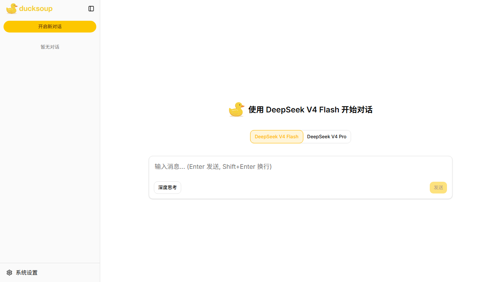
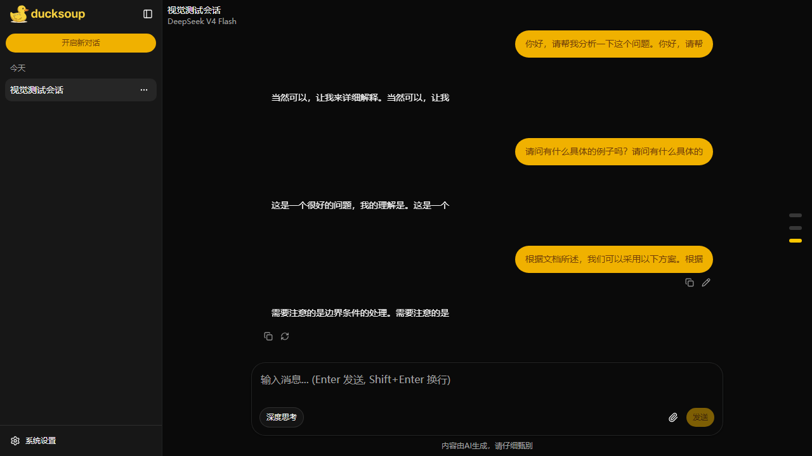

# DuckSoup

> A DeepSeek-powered streaming chat web app — local persistence, bilingual UI, and light / dark themes.

[](https://github.com/lgorthm/ducksoup/actions/workflows/deploy.yml)
[](https://react.dev)
[](https://vite.dev)
[](https://www.typescriptlang.org)
[](https://pnpm.io)
[](https://tailwindcss.com)
[](https://biomejs.dev)
[](./LICENSE)

> 📖 中文文档：[README.md](./README.md)

<p align="center">
  
</p>

<p align="center">
  <picture>
    <source media="(prefers-color-scheme: dark)" srcset=".github/assets/preview-dark.png">
    
  </picture>
</p>

<details>
<summary>Light welcome · Dark conversation</summary>




</details>

## Contents

- [Features](#features)
- [Tech Stack](#tech-stack)
- [Prerequisites](#prerequisites)
- [Quick Start](#quick-start)
- [Configuration](#configuration)
- [Command Reference](#commands)
- [Adding UI Components](#ui-components)
- [Project Structure](#structure)
- [Testing](#testing)
- [Performance & Bundle Tracking](#perf)
- [Deployment](#deploy)
- [Contributing](#contributing)
- [License](#license)
- [Acknowledgements](#thanks)

<a id="features"></a>

## ✨ Features

- **Streaming responses** — token-by-token SSE rendering, with thinking process and mid-stream cancel
- **Two models** — DeepSeek V4 Flash (vision) and DeepSeek V4 Pro (text); the model is fixed per conversation
- **Image attachments** — Flash accepts JPEG / PNG / GIF / WebP, up to 16 per message; blobs are stored in IndexedDB
- **Deep Think** — toggle reasoning effort from the composer (`reasoning.effort`)
- **Message actions** — copy, edit, regenerate, continue after abort; edit / regenerate forks a sibling branch you can switch between
- **Conversation management** — pin, group by date (today / yesterday / 7 days / 30 days); virtualized message list
- **Local persistence** — chats and images live in IndexedDB (`idb`); the API key stays in `localStorage` and never leaves the browser except for DeepSeek API calls
- **Light / dark theme** — `light` / `dark` / `system` in Settings, persisted
- **Bilingual UI** — Simplified Chinese by default, English fallback, switchable in Settings
- **Markdown** — GFM + Prism highlighting, lazy-loaded renderer
- **Account balance** — query DeepSeek balance from Settings
- **Accessibility** — keyboard navigable; Playwright + `@axe-core/playwright` against WCAG 2.0 / 2.1 A/AA

<a id="tech-stack"></a>

## 🛠️ Tech Stack

| Category      | Technology                                           |
| ------------- | ---------------------------------------------------- |
| Framework     | React 19 + TypeScript 6 + Vite 8                     |
| Styling       | Tailwind CSS v4 + shadcn/ui (`base-lyra`)            |
| UI            | Base UI, lucide-react, sonner                        |
| State         | Zustand 5 + Immer                                    |
| Routing       | react-router v7 (Data Mode)                          |
| i18n          | i18next + react-i18next                              |
| Persistence   | `idb` (IndexedDB)                                    |
| LLM           | OpenAI SDK → DeepSeek API (SSE)                      |
| Virtualization | `@tanstack/react-virtual`                           |
| Quality       | Biome, Vitest, Playwright                            |
| Observability | Sentry (production only; not required locally)       |

<a id="prerequisites"></a>

## 📋 Prerequisites

- **Node.js** ≥ 22
- **pnpm** ≥ 10 ([install guide](https://pnpm.io/installation))

This repo pins `packageManager` to `pnpm@10.28.0`.

<a id="quick-start"></a>

## 🚀 Quick Start

```bash
# 1. Clone the repo
git clone git@github.com:lgorthm/ducksoup.git
cd ducksoup

# 2. Install dependencies
pnpm install

# 3. Start the dev server
pnpm dev
```

Open http://localhost:5173. On first launch an API key dialog appears — paste a key from the [DeepSeek platform](https://platform.deepseek.com/) and start chatting. No `.env` file is required.

<a id="configuration"></a>

## ⚙️ Configuration

All settings live in the browser's `localStorage`:

| Setting          | localStorage key   | Notes                                                                                    |
| ---------------- | ------------------ | ---------------------------------------------------------------------------------------- |
| DeepSeek API key | `deepseek-api-key` | First-run dialog, or **Settings → API KEY**                                              |
| UI language      | `i18nLang`         | `zh-CN` (default) / `en`; detection: `localStorage` → browser language → `en` fallback   |
| Theme mode       | `theme`            | `light` / `dark` / `system`; change in **Settings → General**                            |

> The key is used only for DeepSeek API requests. It is not uploaded to this app's server.

<a id="commands"></a>

## 💻 Command Reference

| Command              | Action                                                                   |
| -------------------- | ------------------------------------------------------------------------ |
| `pnpm dev`           | Start the Vite dev server                                                |
| `pnpm build`         | Type-check (`tsc -b`) + production build                                 |
| `pnpm typecheck`     | Type-check only (`tsc -b`)                                               |
| `pnpm lint`          | Biome check (lint + format)                                              |
| `pnpm format`        | Biome format + safe fixes                                                |
| `pnpm preview`       | Preview the production build locally                                     |
| `pnpm test`          | Unit / integration tests (Vitest)                                        |
| `pnpm test:watch`    | Watch mode for tests                                                     |
| `pnpm test:coverage` | Tests + coverage report (thresholds 75 / 65 / 70 / 75)                   |
| `pnpm test:ui`       | Vitest browser UI                                                        |
| `pnpm test:e2e`      | End-to-end tests (Playwright)                                            |
| `pnpm test:e2e:ui`   | Playwright interactive UI                                                |
| `pnpm perf`          | Full performance pipeline: build → bundle sizes → Lighthouse CI → compare |
| `pnpm perf:bundle`   | Bundle-only check (faster, no browser)                                   |

Run a single test: `pnpm test <file-path-or-pattern>`.

<a id="ui-components"></a>

## 🧩 Adding UI Components

shadcn/ui installs into `src/shared/components/ui/` (not `src/components/`). The style is `base-lyra`:

```bash
pnpm dlx shadcn@latest add button
```

```tsx
import { Button } from '@/shared/components/ui/button';
```

<a id="structure"></a>

## 🏗️ Project Structure

```
src/
├── main.tsx                 # StrictMode → ThemeProvider → RouterProvider + Toaster
├── instrument.ts            # Sentry (prod + DSN only)
├── routes/                  # createBrowserRouter: ChatLayout > ChatPage @ "/"
├── stores/                  # Zustand: slices / actions / selectors / models
├── features/
│   ├── chat/                # Chat UI, layouts, SSE, IndexedDB, vision attachments
│   └── settings/            # Settings dialog (theme / language / API key / balance)
├── shared/                  # shadcn, i18n, ThemeProvider, Markdown
├── mocks/                   # MSW DeepSeek SSE handlers
└── tests/setup.ts           # Vitest global setup
```

<a id="testing"></a>

## 🧪 Testing

**Vitest** (jsdom): tests are co-located with source (`src/**/*.{test,spec}.{ts,tsx}`). `src/tests/setup.ts` already provides `fake-indexeddb`, `matchMedia`, Resize / Intersection Observer, MSW lifecycle, and i18n — no need to re-mock these per file.

**Playwright**: `desktop-chromium` (1440×900) and `mobile-iphone` (iPhone 15). Coverage includes the core chat flow, conversation switch / pin, scroll navigation, visual regression, accessibility audits, and large-dataset switch benchmarks:

- 1K messages < 200ms
- 5K < 350ms
- 10K < 500ms
- 500-conversation sidebar render; 10 sequential switches with no degradation

Visual baselines live under `e2e/visual/*.spec.ts-snapshots/`. Update with:

```bash
pnpm exec playwright test e2e/visual/ -u
```

<a id="perf"></a>

## 📈 Performance & Bundle Tracking

`pnpm perf` pipeline:

1. `PERF=1 pnpm build` (optional `rollup-plugin-visualizer` → `perf/stats.html`)
2. `scripts/perf/collect-bundle.mjs` collects raw / gzip / brotli → `perf/history.json`
3. `lhci autorun` (3 runs, median)
4. `scripts/perf/compare.mjs` diffs against the previous history entry and exits 1 on regression

Thresholds are at the top of `scripts/perf/compare.mjs`: gzip total > +2%, LCP > +200ms, CLS > +0.02, INP > +50ms, performance score > −3 points.

`perf/history.json` and `perf/report.md` are committed as a shared baseline across machines / CI. `pnpm perf:bundle` skips Lighthouse and compares bundle size only.

<a id="deploy"></a>

## 🚀 Deployment

Pushing to `main` triggers [`.github/workflows/deploy.yml`](./.github/workflows/deploy.yml):

1. `pnpm install --frozen-lockfile` (Node 22)
2. `pnpm build`
3. Sync `dist/` to an Nginx host over SSH / rsync

Optional CI secrets: `VITE_SENTRY_DSN`, `SENTRY_AUTH_TOKEN` (production error reporting and source map upload). Not required for local development.

> **No staging environment** — `main` is live; do not push a broken build.

<a id="contributing"></a>

## 🤝 Contributing

Git hooks (husky) run automatically:

- **pre-commit**: `lint-staged` + `typecheck` + unit tests
- **pre-push**: full E2E suite (Playwright auto-starts the dev server)

Bypass with `--no-verify` in emergencies. Commit messages should follow [Conventional Commits](https://www.conventionalcommits.org/): `type(scope): subject` (English, imperative mood, lowercase first letter, no trailing period).

<a id="license"></a>

## 📄 License

This project is open-sourced under the [MIT License](./LICENSE).

Copyright (c) 2026 alwaysblue &lt;maybelxr@gmail.com&gt;

<a id="thanks"></a>

## 🙏 Acknowledgements

- [DeepSeek](https://www.deepseek.com/) — LLM service
- [shadcn/ui](https://ui.shadcn.com/) — UI component system
- [Base UI](https://base-ui.com/) — unstyled accessible primitives
- [Tailwind CSS](https://tailwindcss.com/) — atomic CSS
- [Vite](https://vite.dev/) — frontend build tool
